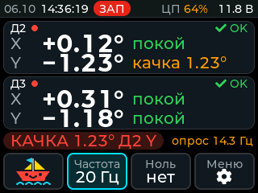
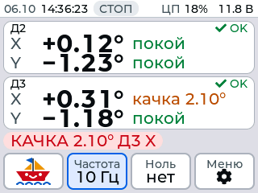
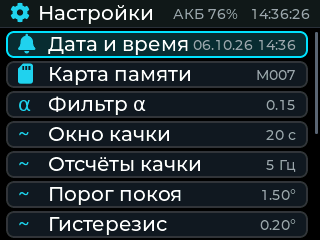
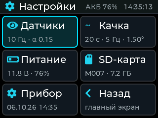
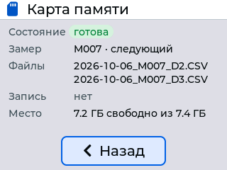
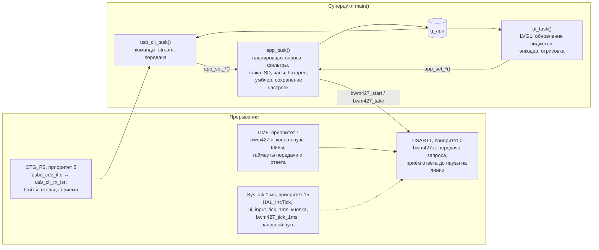

# Регистратор крена для опыта кренования (STM32F411 + BWM427)

Прошивка переносного прибора для опыта кренования судна: прибор опрашивает два
инклинометра BWM427 по RS485 (Modbus RTU), фильтрует углы, показывает их на
экране и пишет замер на SD-карту — по CSV-файлу на каждый датчик, с привязкой
ко времени часов DS3231. Управление — энкодером с кнопкой и тумблером записи;
по USB прибор виден как виртуальный COM-порт с командной строкой, через который
его можно диагностировать, настраивать и перепрошивать без кнопок BOOT0/NRST.

<p align="center">
  
  
</p>
<p align="center">
  
  
  
</p>
<p align="center"><sub>Снимки из симулятора интерфейса (<code>tools/ui_sim</code>): идёт запись, качка по
оси Y датчика Д2, шина не успевает за 20 Гц; запись остановлена, качка по оси X датчика Д3
(светлая тема); меню — список (вид A, по умолчанию) и плитки (вид B); «Карта памяти».</sub></p>

## Содержание

- [Возможности](#возможности)
- [Железо и распиновка](#железо-и-распиновка)
- [Архитектура](#архитектура)
- [Структура каталогов](#структура-каталогов)
- [Модули и их API](#модули-и-их-api)
- [Протокол BWM427](#протокол-bwm427)
- [Формат файлов на SD-карте](#формат-файлов-на-sd-карте)
- [Командная строка по USB](#командная-строка-по-usb)
- [Сборка](#сборка)
- [Прошивка](#прошивка)
- [Тесты](#тесты)
- [Симулятор интерфейса](#симулятор-интерфейса)
- [Ограничения и известные особенности](#ограничения-и-известные-особенности)
- [История и авторы](#история-и-авторы)
- [Лицензии](#лицензии)

## Возможности

- **Опрос датчиков.** Два BWM427 на одной шине RS485 (Modbus-адреса 2 и 3),
  115200 8N1, частота опроса и записи 1…50 Гц (по умолчанию 10 Гц). Мастер шины
  неблокирующий: транзакции идут в прерываниях, паузы и таймауты отсчитывает
  таймер TIM5 с точностью до микросекунды; по каждой транзакции меряются
  задержка ответа и время на шине. Пропавший датчик помечается
  «нет связи» и периодически опрашивается снова; появившийся во время записи —
  сразу получает свой файл.
- **Фильтрация.** Медиана по трём отсчётам (убирает одиночные выбросы) и
  экспоненциальное сглаживание (EMA, α = 0,01…0,99, по умолчанию 0,15).
- **Ноль.** Кнопка «Ноль» запоминает текущие углы всех отвечающих датчиков как
  ноль; удержание 1 с или пункт меню — сброс нуля. Ноль не сохраняется между
  включениями (задаётся на каждом замере).
- **Качка.** По каждой оси каждого датчика (Д2 X, Д2 Y, Д3 X, Д3 Y): размах
  угла за окно по времени (по умолчанию 20 с), «покой» — размах меньше порога
  (по умолчанию 1,5°, с гистерезисом 0,2°). «ГОТОВ» — в покое все оси всех
  отвечающих датчиков, иначе «КАЧКА» с худшей осью. Окно, число отсчётов в
  секунду, порог и гистерезис настраиваются (см. [Расчёт качки](#расчёт-качки)).
- **Запись на SD.** Тумблер записи: старт/стоп замера; на каждый датчик свой
  CSV, сквозная нумерация замеров, существующие файлы не перезаписываются,
  `f_sync` раз в секунду (при выдёргивании карты теряется не больше ~1 с).
  Карту можно вынуть и вставить на ходу — прибор перемонтирует её сам.
  Свободное место на карте показывается на экране «Карта памяти».
- **Часы.** DS3231 по I2C; без него — программные часы, стартующие со времени
  сборки прошивки. Дата и время задаются из меню.
- **АКБ.** 3S Li-ion 18650: напряжение и примерный заряд в процентах по кривой
  разряда ячейки (3,3 В на ячейку = 0 %, 4,2 В = 100 %); тревога ниже порога
  (по умолчанию 10,0 В, пункт меню «Порог АКБ»); ниже 5 В считается, что
  питание от USB, — тревоги нет.
- **Интерфейс.** ILI9341 320×240, LVGL 9.6, тёмная и светлая темы, энкодер с
  кнопкой; в строке состояния — дата, время, состояние записи и карты,
  загрузка процессора, напряжение (тревога АКБ — мигающая красная плашка);
  на карточках датчиков — углы и качка по осям; фактическая частота опроса,
  если шина не успевает. Меню в двух вариантах (список или плитки), экраны
  «Карта памяти» и «Справка» (с версией прошивки `FW_VERSION` из
  `Core/Inc/version.h`, сейчас 1.3; её же выводит команда `ver`).
- **Настройки** (частота, α, пауза шины, тема, порог тревоги АКБ, параметры
  качки) хранятся в журнале во внутренней флеш-памяти и переживают выключение
  и перепрошивку.
- **Смена Modbus-адреса** датчика из меню прибора (регистр 0x000D + сохранение).
- **USB CDC**: командная строка — версия, снимок состояния, поток телеметрии,
  изменение настроек, перезагрузка в системный загрузчик USB DFU.
- **Проверка без железа**: host-тесты логики (настоящие `app.c`, `bwm427.c`,
  `sd_logger.c`, `settings.c` поверх имитации шины, SD-карты и флеша) и
  симулятор интерфейса на ПК со снимками экрана.

## Железо и распиновка

| Узел | Компонент | Подключение |
|---|---|---|
| МК | STM32F411CEU6 (плата «black pill»), кварц 25 МГц → SYSCLK 96 МГц, USB 48 МГц | — |
| Датчики | 2 × инклинометр BWM427, Modbus RTU | RS485 через MAX485, USART1 |
| Дисплей | ILI9341 320×240, альбомная ориентация, RGB565 | SPI1, 48 МГц |
| Накопитель | microSD (SDSC/SDHC/SDXC, FAT) в режиме SPI | SPI2: 375 кГц при инициализации, 12 МГц при обмене |
| Часы | DS3231 (7-битный адрес 0x68), необязательные | I2C1, 100 кГц |
| Ввод | инкрементальный энкодер с кнопкой, тумблер записи | TIM3 (режим энкодера), GPIO |
| Питание | АКБ Li-ion 3S (18650, `APP_BAT_CELLS` в `app.h`), напряжение — через делитель на АЦП; ниже 5 В считается, что АКБ нет (питание от USB) | ADC1_IN1 |
| USB | виртуальный COM-порт (CDC, 0483:5740) | USB OTG FS |

Распиновка — по `BWM427_Inclinometer.ioc`, `Core/Inc/main.h` и
`Core/Src/stm32f4xx_hal_msp.c`:

| Вывод | Метка / сигнал | Режим | Назначение |
|---|---|---|---|
| PA0 | `ENCODER_SW` | вход с подтяжкой вверх (EXTI0, спад) | кнопка энкодера, активный 0; опрашивается раз в 1 мс из SysTick |
| PA1 | `BAT_SENSE` | ADC1_IN1 | напряжение батареи через делитель 4,03 (VDDA уточняется по VREFINT) |
| PA3 | `SW_RECORD` | вход с подтяжкой вверх | тумблер записи: замкнут на GND — запись (антидребезг 50 мс) |
| PA4 | `SD_CS` | выход | CS SD-карты |
| PA5 / PA6 / PA7 | SPI1 SCK / MISO / MOSI | AF5 | дисплей ILI9341 |
| PA8 | `RS485_DE` | выход | DE MAX485 (1 — передача) |
| PA9 / PA10 | USART1 TX / RX | AF7, RX с подтяжкой вверх | DI / RO MAX485 |
| PA11 / PA12 | USB D− / D+ | USB OTG FS (device) | USB CDC |
| PB0 | `LCD_CS` | выход | CS дисплея |
| PB1 | `LCD_DC` | выход | D/C дисплея (0 — команда) |
| PB2 | `LCD_RST` | выход | сброс дисплея |
| PB4 / PB5 | `ENC_CLK` / `ENC_DT` | TIM3 CH1 / CH2, энкодер, фильтр 10 | энкодер (4 импульса на щелчок) |
| PB6 / PB7 | I2C1 SCL / SDA | AF4, открытый сток | DS3231 |
| PB10 / PB14 / PB15 | SPI2 SCK / MISO / MOSI | AF5, MISO с подтяжкой вверх | SD-карта |
| PB12 | `RS485_RE` | выход | /RE MAX485 (1 — приёмник выключен во время передачи) |
| PC13 | `LED` | выход | светодиод платы, активный 0: горит во время записи |
| PH0 / PH1 | OSC_IN / OSC_OUT | HSE | кварц 25 МГц |

Отладка — по SWD (PA13/PA14, разъём на плате).

## Архитектура

Без ОС: суперцикл в `main()` плюс прерывания. Всё состояние прибора — в
одной структуре `g_app` (`app.h`): её пишет только логика (`app.c`,
`sd_logger.c`) в суперцикле, интерфейс и командная строка читают её и меняют
настройки только через функции `app_*()`. Поскольку и логика, и интерфейс
работают в суперцикле, блокировки не нужны; из прерываний `g_app` не трогается.



| Где | Что выполняется |
|---|---|
| `USART1_IRQHandler` (приоритет 0) | `HAL_UART_TxCpltCallback` — конец передачи, MAX485 на приём; `HAL_UARTEx_RxEventCallback` — принята порция ответа (приём до паузы на линии), проверка кадра; `HAL_UART_ErrorCallback` |
| `TIM5_IRQHandler` (1) | таймер шины в `bwm427.c` (32 бита, 1 МГц, прерывание по сравнению): конец паузы перед запросом — старт передачи, таймауты передачи и ответа. TIM5 занят шиной и в CubeMX не настраивается |
| `OTG_FS_IRQHandler` (5) | стек USB Device; принятые по CDC байты — в кольцо `usb_cli.c`, состояние DTR. Если суперцикл стоит дольше 3 с, строки `boot`/`dfu`/`reset` выполняются прямо здесь (аварийный путь для перепрошивки зависшего прибора) |
| `SysTick_Handler` (15), 1 мс | `HAL_IncTick()`; `ui_input_tick_1ms()` — антидребезг кнопки энкодера и защёлка коротких нажатий; `bwm427_tick_1ms()` — запасной путь для пауз и таймаутов, если прерывание TIM5 не пришло (счётчик `bwm427_fallbacks()`, в норме 0) |
| `EXTI0_IRQHandler` | включён CubeMX для PA0, только сбрасывает флаг (кнопка опрашивается из SysTick) |
| суперцикл | `app_task()` → `ui_task()` → `app_diag_loop()` (длительность прохода по счётчику DWT) → `usb_cli_task()` |

Пакет транзакций Modbus (по одной на датчик) запускается из суперцикла
`bwm427_start()` и выполняется целиком в прерываниях; суперцикл забирает
результат `bwm427_take()` в следующих проходах и сразу планирует следующий
цикл, а потом пишет строки на SD — шина работает, пока идёт запись на карту.
Циклы опроса идут по жёсткому расписанию (момент старта + n · период), поэтому
частота не «плывёт» от длительности проходов суперцикла.

Блокирующие участки суперцикла: запись на SD (`f_write`/`f_sync`), передача
кадра на дисплей (SPI без DMA), сохранение настроек во флеш (~0,2 мс; раз в 4096
сохранений — стирание сектора, 1–2 с; во время записи замера не выполняется).

## Структура каталогов

```
.
├── README.md
├── docs/img/                     снимки экрана для README (из tools/ui_sim)
├── tools/flash/                  перепрошивка и диагностика по USB (Windows: PowerShell, cmd, dfu-util)
└── BWM427_Inclinometer/          проект прошивки
    ├── BWM427_Inclinometer.ioc   конфигурация STM32CubeMX (выводы, тактирование, периферия)
    ├── .project, .cproject, .mxproject   проект STM32CubeIDE / CubeMX
    ├── Makefile                  сборка из командной строки (Arm GNU Toolchain)
    ├── STM32F411CEUX_FLASH.ld    компоновка: FLASH 384 КБ (сектор 7 — настройки), секция .noinit
    ├── STM32F411CEUX_RAM.ld      вариант для запуска из RAM (CubeIDE)
    ├── Core/
    │   ├── Inc/, Src/            код прибора и код, сгенерированный CubeMX (main.c, *_it.c, *_msp.c, system_*.c)
    │   ├── Src/ui/               интерфейс на LVGL, шрифты (fonts/), привязка LVGL к железу (lv_port_*)
    │   └── Startup/              startup_stm32f411ceux.s
    ├── Drivers/                  [сторонний] CMSIS и STM32F4xx HAL 1.8.1 (STM32Cube FW_F4 V1.27.1)
    ├── FATFS/                    связка FatFs с драйвером SD (CubeMX): App/fatfs.c, Target/user_diskio.c, ffconf.h
    ├── Middlewares/
    │   ├── ST/STM32_USB_Device_Library/   [сторонний] ST USB Device Library: ядро и класс CDC
    │   └── Third_Party/
    │       ├── FatFs/            [сторонний] FatFs R0.12c (ChaN) в поставке ST
    │       └── lvgl/             [сторонний] LVGL 9.6.0
    ├── USB_DEVICE/               связка USB CDC в стиле CubeMX (свои правки — в блоках USER CODE)
    ├── tests/host/               host-тесты логики и драйвера SD (gcc на ПК)
    └── tools/ui_sim/             симулятор интерфейса на ПК, генератор шрифтов (fonts/)
```

Сторонний код и его лицензии:

| Компонент | Где | Лицензия |
|---|---|---|
| CMSIS Core (Arm) | `Drivers/CMSIS/Include` | Apache-2.0 (`Drivers/CMSIS/LICENSE.txt`) |
| CMSIS Device STM32F4xx (ST) | `Drivers/CMSIS/Device/ST/STM32F4xx` | Apache-2.0 (`LICENSE.txt` в каталоге) |
| STM32F4xx HAL 1.8.1 (ST) | `Drivers/STM32F4xx_HAL_Driver` | BSD-3-Clause (`LICENSE.txt` в каталоге) |
| ST USB Device Library | `Middlewares/ST/STM32_USB_Device_Library` | ST SLA0044 (Ultimate Liberty), `LICENSE.md` |
| FatFs R0.12c (ChaN) | `Middlewares/Third_Party/FatFs/src` | лицензия FatFs (BSD-подобная, одно условие; текст в заголовке `ff.h`); обвязка ST (`diskio.c`, `ff_gen_drv.c`, `FATFS/`) — условия в заголовках файлов |
| LVGL 9.6.0 | `Middlewares/Third_Party/lvgl` | MIT (`LICENCE.txt`; встроенные библиотеки — свои лицензии внутри `src/libs`, `src/stdlib/builtin`) |
| Montserrat | исходники `tools/ui_sim/fonts/src`, растеризованные шрифты `Core/Src/ui/fonts` | SIL OFL 1.1 (`tools/ui_sim/fonts/licenses`) |
| DejaVu Sans (подмножество: α, ●) | то же | лицензия Bitstream Vera / DejaVu (`tools/ui_sim/fonts/licenses`) |
| Font Awesome 5 Free (значки `LV_SYMBOL_*`) | то же | Font Awesome Free License (`tools/ui_sim/fonts/licenses`) |
| Растровые шрифты 7×10, 11×18, 16×26 | `Core/Src/fonts.c`, `Core/Inc/fonts.h` | из библиотеки [afiskon/stm32-ili9341](https://github.com/afiskon/stm32-ili9341), MIT, © 2018 Aleksander Alekseev; от неё же унаследован текстовый API `ili9341.c` |

## Модули и их API

### `app.h` / `app.c` — логика прибора и общее состояние

Контракт: логика пишет в `g_app`, интерфейс (`ui/`) и `usb_cli.c` только читают
`g_app` и меняют настройки через `app_*()`. Всё вызывается из суперцикла.

| Элемент | Назначение |
|---|---|
| `app_state_t g_app` | датчики `sensor[APP_SENSOR_COUNT]` (статус `SENSOR_ABSENT/OK/LOST`, `raw_*` — ответ датчика, `filt_*` — после медианы и EMA, `off_*` — ноль, `x/y = filt − off`, счётчики ответов/ошибок/битых кадров; качка по осям: размах `roll_x/roll_y`, покой `calm_x/calm_y`, накоплено окна `roll_fill_s`); настройки `log_freq_hz`, `ema_alpha`, `bus_gap_ms`, `theme`, параметры качки `roll_window_s`, `roll_rate_hz`, `roll_calm_deg`, `roll_hyst_deg`; фактическая частота `actual_rate_hz`; SD: `sd_state`, `sd_err`, `file_number`, `rec_*`, ёмкость и свободное место `sd_total_mb`/`sd_free_mb` (`APP_SD_FREE_UNKNOWN` — не посчитано); АКБ: `battery_v`, `battery_present`, `battery_low`, заряд `battery_pct` (`APP_BAT_PCT_NONE` — АКБ нет), `battery_adc_sat`, порог `bat_alarm_v`; сводка качки `is_stable`, худшая ось `stab_sensor`/`stab_axis`/`stab_span`, наименьшее накопленное окно `stab_fill_s`; часы `time`/`rtc_present`; `svc_state` (смена адреса); статистика шины `bus`; диагностика суперцикла `diag` (в т. ч. загрузка процессора `diag.cpu_load_pct`) |
| `APP_SENSOR_COUNT`, `APP_SENSOR_ADDR(i)`, `app_sensor_index(addr)` | 2 датчика с адресами `i + 2` (Д2, Д3); индекс по адресу (−1 — не наш) |
| `app_init()` | после `MX_*_Init()`: настройки из флеша, часы, АЦП, шина RS485, монтирование SD |
| `app_task()` | каждый проход суперцикла: тумблер, часы, батарея, опрос, SD, отложенное сохранение настроек, светодиод |
| `app_set_log_freq(hz)`, `app_set_ema_alpha(a)`, `app_set_bus_gap(ms)`, `app_set_theme(t)`, `app_set_bat_alarm(v)` | изменить настройку (значение приводится в допустимые пределы) и запланировать сохранение во флеш |
| `app_set_roll_window(s)`, `app_set_roll_rate(hz)`, `app_set_roll_calm(deg)`, `app_set_roll_hyst(deg)` | параметры качки — так же; смена окна или числа отсчётов в секунду сбрасывает накопленные окна |
| `app_zero_all()`, `app_zero_reset()` | задать ноль по текущим углам отвечающих датчиков / сбросить ноль |
| `app_set_time(&t)` | установить часы (и DS3231, если он есть) |
| `app_sensor_set_address(old, new)` | асинхронная смена Modbus-адреса датчика, результат в `g_app.svc_state` |
| `app_diag_loop(app_cycles, ui_cycles)` | учёт длительности прохода суперцикла для `g_app.diag` (проходов в секунду, самый долгий проход, загрузка процессора `cpu_load_pct`) |
| `app_bus_stats_reset()`, `app_stat_avg_us()` | статистика шины RS485: по датчикам — таймауты, битые CRC и кадры, задержка ответа (`lat_first`, `lat_done`), текущий таймаут; по шине (`g_app.bus`) — паузы, простой перед циклом, время цикла на шине, срабатывания запасного пути |
| `app_days_in_month()`, `app_time_valid()`, `app_time_add_second()`, `app_time_from_build()` | календарь (чистые функции, годы 2000–2099) |
| `app_bat_pct(volts)` | заряд АКБ 3S, 0…100 % (чистая функция, кусочно-линейная кривая разряда ячейки без нагрузки: 3,3 В — 0 %, 3,8 В — 50 %, 4,2 В — 100 %) |

Значения по умолчанию (пока во флеше нет записи): 10 Гц, α = 0,15, пауза шины
15 мс, тёмная тема, порог тревоги АКБ 10,0 В (допустимо 5…30 В), качка — окно
20 с, 5 отсчётов в секунду, порог покоя 1,5°, гистерезис 0,2°. Датчик
переходит из OK в «нет связи» после трёх неудач подряд; неотвечающий датчик
пробуется не чаще раза в секунду (первые 3 с после включения — раз в 200 мс),
не больше одной пробы за цикл и последней в цикле.

АКБ: среднее напряжение обновляется каждые ~320 мс; тревога — после трёх
средних подряд ниже порога (~1 с, одиночный провал под нагрузкой не в счёт),
снимается выше порога + 0,3 В; ниже 5 В (`APP_BAT_PRESENT_MIN_V`) АКБ считается
отключённой (питание от USB), заряд не считается, тревоги нет.

### Расчёт качки

`roll_update()`, `stability_update()`, `roll_calm()` в `app.c`; считается после
каждого цикла опроса для датчиков со свежим отсчётом.

- **Окно — по времени**, а не по числу отсчётов: по умолчанию 20 с (10…60 с,
  меню «Окно качки», `set rollwin N`), чтобы в него помещался хотя бы один
  период бортовой качки (5–20 с) при любой частоте опроса.
- **Прореживание.** В окно берётся отсчёт по расписанию раз в
  1000 / `roll_rate_hz` мс — по умолчанию 5 в секунду (2…5, «Отсчёты качки»,
  `set rollhz N`) независимо от частоты опроса; при опросе реже — каждый.
- **Размах** = максимум − минимум за окно по `filt_x`/`filt_y` (после фильтра,
  до вычитания нуля — кнопка «Ноль» не даёт ложного скачка). Отсчёты хранятся
  в кольцевом буфере на датчик в сотых долях градуса (`int16`) с меткой
  времени; буфер рассчитан на наибольшее окно: 60 с × 5 + 5 = 305 отсчётов,
  4 904 байта (~4,9 КБ) ОЗУ на два датчика.
- **Покой** по оси — размах меньше порога (по умолчанию 1,5°, 0,10…10°,
  «Порог покоя», `set rollcalm X`); снимается, когда размах больше порога +
  гистерезис (по умолчанию 0,2°, 0…2°, «Гистерезис», `set rollhyst X`). Пока
  окно не заполнено (после включения, пропажи датчика, смены окна или числа
  отсчётов), покоя нет — на экране «сбор N с».
- **Сводка:** `is_stable` — в покое все оси всех отвечающих датчиков (и хотя
  бы один отвечает); худшая ось — `stab_sensor`, `stab_axis`, `stab_span`;
  `stab_fill_s` — наименьшее накопленное окно.
- **Нагрузка.** Каждый взятый в окно отсчёт — проход от нового отсчёта к
  старым до границы окна (window × rate мест): оценка по дизассемблеру прошивки
  (~60 тактов на отсчёт двух осей) — ~6 тыс. тактов (~0,06 мс) при окне 20 с и
  ~18 тыс. (~0,19 мс) при 60 с. Два датчика по 5 отсчётов в секунду —
  ≈0,06 % процессора при окне 20 с, ≈0,2 % при 60 с.
- Параметры сохраняются во флеш вместе с остальными настройками (поля
  `roll_*` записи журнала).

### `bwm427.h` / `bwm427.c` — Modbus RTU мастер, протокол, фильтры

| Функции | Назначение |
|---|---|
| `bwm427_init()`, `bwm427_set_gap_ms(ms)` | MAX485 на приём, USART1 на `BWM427_BAUD`; пауза тишины перед каждым запросом (`BWM427_GAP_MS`…`BWM427_GAP_MAX_MS` = 2…100 мс) |
| `bwm427_start(xfer, n)`, `bwm427_take()`, `bwm427_idle()` | запустить пакет из `n ≤ 4` транзакций; забрать результат (один раз); шина свободна |
| `bwm427_tick_1ms()`, `bwm427_fallbacks()` | из SysTick: запасной путь для пауз и таймаутов, если TIM5 не сработал; сколько раз он понадобился |
| `bwm427_port_init/us/alarm/alarm_off()`, `bwm427_alarm_isr()` | таймер шины: на МК — TIM5, в host-тестах (`-DBWM427_TIMER_FAKE`) — имитация |
| `bwm427_xfer_read()`, `bwm427_xfer_write()`, `bwm427_build_request()`, `bwm427_reply_len()`, `bwm427_frame_need()`, `bwm427_parse_reply()`, `bwm427_crc16()` | формирование и разбор кадров (чистые функции) |
| `bwm427_decode_angle()`, `bwm427_decode_xy()` | перевод регистров в градусы — единственное место с формулой |
| `bwm427_median3()`, `bwm427_ema()`, `bwm427_filter_reset()`, `bwm427_filter_step()` | фильтр: медиана-3 + EMA по двум осям |

Результат транзакции — `bwm427_result_t`: `OK`, `TIMEOUT`, `CRC`, `BAD_FRAME`
(чужой адрес/функция/длина, неполный кадр), `EXCEPTION` (код в `exc_code`),
`UART`, `PENDING`. Кроме того, в `bwm427_xfer_t` драйвер записывает времена
транзакции в микросекундах: тишину перед запросом (`gap_us`), задержку ответа до
первого байта и до конца кадра (`lat_first_us`, `lat_done_us`) и длительность
(`dur_us`); вызывающий может задать свой таймаут ответа (`timeout_us`).

### `sd_logger.h` / `sd_logger.c` — запись замеров

| Функции | Назначение |
|---|---|
| `sd_logger_init()` | смонтировать карту при старте и найти номер следующего замера |
| `sd_logger_task()` | автомат `SD_NO_CARD → SD_READY → SD_RECORDING`, `SD_ERROR`: старт/стоп по тумблеру, `f_sync` раз в секунду, проверка наличия карты, повторное монтирование |
| `sd_logger_write_cycle(fresh)` | после цикла опроса: строка в файл каждого датчика со свежим отсчётом; файлы для появившихся датчиков |
| `sd_logger_file_name(i, out)` | имя файла датчика в текущем или следующем замере |
| `sd_format_row()`, `sd_make_name()`, `sd_parse_name()`, `sd_number_after()` | строка CSV и имена файлов (чистые функции) |

Место на карте (`g_app.sd_total_mb`, `sd_free_mb`) считается `f_getfree` после
монтирования и после остановки записи, во время записи — по счётчику свободных
кластеров FatFs (раз в секунду, без чтения карты). Если на FAT32 счётчика нет
в FSInfo, полный обход FAT занял бы секунды — его не делают, место «неизвестно»
(`APP_SD_FREE_UNKNOWN`).

### `fatfs_sd.h` / `fatfs_sd.c` — драйвер SD-карты (SPI2)

`SD_disk_initialize/status/read/write/ioctl()` — для FatFs (через
`FATFS/Target/user_diskio.c`), `SD_disk_check()` — быстрая проверка наличия карты
чтением сектора 0. SDv1, SDv2 SDSC, SDHC/SDXC. Без карты любая операция
возвращается за миллисекунды (короткие ожидания при инициализации и проверке),
ошибка обмена снимает инициализацию — дальше «не готова» сразу, до повторной
инициализации из `sd_logger.c`.

### `settings.h` / `settings.c` — настройки во флеше

`settings_load()`, `settings_store()`, `settings_touch(now)`, `settings_due(now)`,
`settings_get_info()`. Журнал в секторе 7 (0x08060000, 128 КБ): записи по 32
байта (magic «SET1», номер `seq`, значения, CRC-32), новая запись дописывается
в первое чистое место, при включении берётся правильная запись с наибольшим
`seq`. Хранятся частота, α, пауза шины, тема, порог АКБ и параметры качки
(`roll_window_s`, `roll_rate_hz`, `roll_calm_cdeg`, `roll_hyst_cdeg` — порог и
гистерезис в сотых градуса); в записях старых прошивок на месте полей качки
резерв 0xFF…, они читаются как «нет поля» — берутся значения по умолчанию.
Сектор стирается, только когда заполнен (4096 сохранений на стирание).
Сохранение — через 3 с после последнего изменения и не во время записи замера.
Доступ к флешу сведён к `settings_flash_*()`, в host-тестах — имитация.

### `usb_cli.h` / `usb_cli.c` — командная строка USB CDC

`usb_cli_boot_check()` — в самом начале `main()`, до `HAL_Init()`: если перед
программным сбросом была команда `boot`, переход в системный загрузчик;
`usb_cli_task()` — каждый проход суперцикла; `usb_cli_rx_isr()`,
`usb_cli_line_state_isr()` — из прерывания OTG_FS (`usbd_cdc_if.c`). Команды — в
разделе [Командная строка по USB](#командная-строка-по-usb).

### `ui.h`, `Core/Src/ui/` — интерфейс

| Файл | Назначение |
|---|---|
| `ui.h` | `ui_init()` (после `ILI9341_Init()`), `ui_task()` (каждый проход: обновление виджетов из `g_app` раз в 100 мс и `lv_timer_handler()`), `ui_input_tick_1ms()` (из SysTick) |
| `ui.c` | инициализация LVGL, таблицы цветов тёмной и светлой тем (цвета задаются ролями, смена темы перекрашивает готовые экраны без пересоздания), общие стили и помощники, временные экраны (`ui_screen_create_temp()`) |
| `ui_main.c` | главный экран: строка состояния, карточки Д2/Д3 (связь, X, Y, качка по осям), сводка качки, строка сообщений, органы управления (кораблик, «Частота», «Ноль», «Меню») |
| `ui_settings.c` | меню «Настройки» в двух видах (список или плитки с подменю, `UI_MENU_STYLE`); экраны даты/времени и смены адреса |
| `ui_sd.c` | экран «Карта памяти»: состояние карты, номер замера, имена файлов текущего или следующего замера, время и число строк записи, свободное место |
| `ui_help.c` | экран «Справка»: версия (`FW_VERSION` из `Core/Inc/version.h`) и дата сборки, кратко о функциях прибора |
| `ui_internal.h` | общее для файлов интерфейса: роли цветов, шрифты, помощники, выбор вида меню `UI_MENU_STYLE` |
| `lv_port.h`, `lv_port_disp.c`, `lv_port_indev.c` | единственные файлы интерфейса, работающие с HAL: дисплей LVGL (частичная отрисовка полосами по 20 строк, блокирующий SPI1) и энкодер (TIM3 + PA0). Симулятор подставляет свои реализации |
| `fonts/` | шрифты LVGL, сгенерированные `tools/ui_sim/fonts/gen_fonts.py`: Montserrat Medium 14 и 20 (только символы строк интерфейса, кириллица, значки), Montserrat Bold 30 (цифры и знаки углов); 2 бит/пиксель, цифры моноширинные |

**Главный экран** (сверху вниз):

- строка состояния: дата (ДД.ММ) и время (без DS3231 — оранжевым), плашка
  записи «ЗАП» (мигает) / «СТОП» / «СБОЙ» (ошибка записи на SD) / «НЕТ SD»,
  загрузка процессора «ЦП NN%» (от 50 % оранжевым, от 80 % красным),
  напряжение питания (тревога АКБ — мигающая красная плашка, от USB — «USB»);
- карточки Д2 и Д3: связь (✓ OK / нет связи / не подключен / битые ответы:
  дубль адреса?), точка ● — датчик пишется на карту; углы X и Y, справа от
  каждого — качка по оси: «покой» (зелёный), «качка 1.23°» (оранжевый, больше
  3° — красный), «сбор 12 с» (окно ещё не набрано);
- сводка качки: «✓ ГОТОВ» / «КАЧКА 2.10° Д3 X» (худшая ось) / «сбор 12/20 с»
  («КАЧКА —» — ни один датчик не отвечает);
  справа — строка сообщений (по важности: только что показанное сообщение,
  тревога АКБ, «опрос … Гц», ошибка SD, время записи, подсказка у «Ноль»);
- органы управления: [кораблик] [Частота] [Ноль] [Меню]. Ячейка с корабликом —
  место под будущую функцию, в фокус не попадает.

**Меню «Настройки»** — два вида, выбираются `UI_MENU_STYLE` в `ui_internal.h`
(по умолчанию A); в заголовке справа — заряд АКБ («АКБ 76%», от USB — «USB») и
часы:

- **A — список** (`UI_MENU_LIST`) с прокруткой: Дата и время, Карта памяти,
  Фильтр α, Окно качки, Отсчёты качки, Порог покоя, Гистерезис, Адрес датчика,
  Сбросить ноль, Пауза шины, Порог АКБ, Тема, Справка (с версией), Назад;
- **B — плитки** (`UI_MENU_TILES`) с кратким состоянием, за ними подменю без
  прокрутки: Датчики (Частота, Фильтр α, Пауза шины, Адрес датчика, Сбросить
  ноль), Качка (Окно, Отсчёты, Порог покоя, Гистерезис), Питание (напряжение,
  заряд, Порог АКБ), SD-карта (экран «Карта памяти»), Прибор (Дата и время,
  Тема, Справка), Назад.

Экраны «Дата и время», «Адрес датчика», «Карта памяти» и «Справка» общие для
обоих видов; «Назад» возвращает туда, откуда пришли. Главный экран и корень
меню живут всё время, остальные экраны и подменю строятся при входе и
удаляются при уходе — куча LVGL (`LV_MEM_SIZE` = 48 КБ) занята в симуляторе
максимум на ~32 КБ.

Управление энкодером: вращение — переход между элементами; нажатие на поле
(«Частота», «Фильтр α», параметры качки, «Порог АКБ», поля даты и адреса) —
режим правки (вращение меняет значение, повторное нажатие — выход); нажатие на
кнопку — действие; «Ноль»: нажатие — задать ноль, удержание 1 с — сбросить;
«Пауза шины» — нажатие перебирает значения; в «Справке» вращение прокручивает
текст, нажатие — назад.

### `ili9341.h` / `ili9341.c` — дисплей

`ILI9341_Init()`, блочная запись для LVGL: `ILI9341_SetWindow()`,
`ILI9341_WritePixels()`, `ILI9341_EndWrite()`, `ILI9341_DrawBitmap()`. Старый
текстовый API (`ILI9341_WriteString()` и шрифты `fonts.c`) прошивкой не
используется.

Сборка без интерфейса (`make UI=0`): в `app.c` есть слабые заглушки `ui_init()`,
`ui_task()`, `ui_input_tick_1ms()`, прибор работает без экрана (опрос, запись,
USB).

## Протокол BWM427

Modbus RTU, 115200 8N1 (по умолчанию у датчика 9600 — регистр 0x000B; датчики
прибора перенастроены на 115200). CRC16 Modbus (полином 0xA001, начальное
0xFFFF), младшим байтом вперёд.

| Регистр | Доступ | Назначение |
|---|---|---|
| 0x0001 | чтение (0x03) | угол X |
| 0x0002 | чтение (0x03) | угол Y |
| 0x000B | — | скорость обмена (прошивкой не меняется) |
| 0x000D | запись (0x06) | Modbus-адрес датчика |
| 0x000F | запись (0x06), значение 0 | сохранить настройки во флеш датчика |

Опрос: запрос `addr 03 00 01 00 02 CRC` (8 байт), ответ
`addr 03 04 Xhi Xlo Yhi Ylo CRC` (9 байт).
**Угол = (регистр − 10000) / 100**, градусы, шаг 0,01° (регистр 10000 — 0°);
формула задана только в `bwm427_decode_angle()`.

Транзакция: пауза тишины на шине → DE/RE = 1, передача по прерыванию → по
окончании передачи DE/RE = 0 → приём до паузы на линии
(`HAL_UARTEx_ReceiveToIdle_IT`), поэтому короткий ответ-исключение не ждёт
таймаута; ответ, пришедший кусками, дочитывается. Паузу и таймауты отсчитывает
TIM5 (1 МГц) от конца предыдущей транзакции. Полный таймаут ответа — время 17
символов + 28 мс запаса датчика (30 мс при 115200); датчику, который уже
стабильно отвечает, `app.c` задаёт таймаут короче — по измеренной задержке его
ответов, чтобы пропущенный ответ отнимал меньше времени цикла.

**Пауза шины.** По Modbus между кадрами достаточно 3,5 символа, но BWM427 делят
кадры по своей, заметно большей паузе тишины: запрос к одному датчику,
отправленный через 2–3 мс после ответа другого, сливается с этим ответом в
один «кадр» с неверной CRC и игнорируется — на шине работал только первый
найденный датчик. Поэтому перед каждым запросом выдерживается настраиваемая
пауза: по умолчанию 15 мс, 2…100 мс (меню «Пауза шины» перебирает 3, 5, 8, 10,
15, 20, 30, 50 мс; `set gap N` по USB).

**Смена адреса** (`app_sensor_set_address(old, new)`, меню «Адрес датчика»):
1. запись `0x000D = new` по старому адресу (эхо принимается и со старого, и с
   нового адреса; исключение — отказ);
2. запись `0x000F = 0` по новому адресу; если нет ответа —
3. то же по старому адресу.

На шине при этом должен быть только этот датчик (новые датчики приходят с
адресом 1, в меню по умолчанию 1 → 3). Битые ответы на опрос показываются на
карточке датчика как «битые ответы: дубль адреса?» — обычно это два датчика с
одинаковым адресом.

## Формат файлов на SD-карте

Карта FAT (FatFs с длинными именами). Файлы — в корне, по одному на датчик:

```
YYYY-MM-DD_MNNN_Dk.CSV        например 2026-10-06_M007_D2.CSV
```

- `YYYY-MM-DD` — дата начала замера по часам прибора (все файлы замера — с этой
  датой, даже если запись перешла через полночь);
- `MNNN` — номер замера, не меньше трёх цифр (`M007`, … `M9999`). Номера
  сквозные по карте: следующий = наибольший номер на карте + 1 (учитываются и
  старые имена `M_NNN_k.CSV`). Существующий файл никогда не перезаписывается;
- `Dk` — Modbus-адрес датчика (`D2`, `D3`).

Содержимое — CSV с заголовком, разделитель — запятая, десятичная точка:

```
Time,RawX,RawY,OffsetX,OffsetY,CalcX,CalcY,BatV,Ms
06.10.26 14:36:19,0.120,-1.230,0.000,0.000,0.120,-1.230,11.8,1530
```

| Колонка | Смысл |
|---|---|
| `Time` | часы прибора `ДД.ММ.ГГ ЧЧ:ММ:СС` в момент записи строки (разрешение 1 с) |
| `RawX`, `RawY` | угол, градусы, 3 знака: **после фильтра (медиана-3 + EMA), но до вычитания нуля** — не сырой ответ датчика (имя колонки историческое, его читает скрипт обработки) |
| `OffsetX`, `OffsetY` | ноль, заданный кнопкой «Ноль» |
| `CalcX`, `CalcY` | `Raw − Offset` — то, что показывается на экране |
| `BatV` | напряжение батареи, В, 1 знак |
| `Ms` | миллисекунды от начала записи до ответа датчика — точное время отсчёта (в одной секунде `Time` бывает до 50 строк) |

Строка пишется для каждого датчика, давшего в цикле свежий отсчёт. Строки
копятся в RAM и пишутся кусками по 512 байт; раз в секунду остаток дописывается
и делается `f_sync`. Ошибка записи останавливает замер (`SD_ERROR`, на экране
код ошибки FatFs); новый замер — после возврата тумблера в STOP.

## Командная строка по USB

Прибор — USB CDC (виртуальный COM-порт, VID:PID 0483:5740; Windows 10+
подключает стандартный `usbser.sys` без отдельного драйвера). Скорость порта
значения не имеет. Команды — строки ASCII
(регистр не важен, конец строки CR и/или LF, до 64 символов); ответ — строки с
`\r\n`, последняя — `OK…` или `ERR…`. Без открытого порта вывод выбрасывается,
суперцикл USB не ждёт.

| Команда | Действие |
|---|---|
| `help` (`?`) | список команд |
| `ver` | дата и время сборки, версия HAL, частота ядра, UID кристалла |
| `diag` | разовый снимок: суперцикл и загрузка процессора, датчики (статус, X/Y, счётчики, последняя ошибка), задержки ответа датчиков и статистика шины, фактическая частота, SD и имена файлов, батарея (напряжение, заряд, тревога), часы, тумблер, стабильность, пауза шины, тема, состояние журнала настроек, энкодер, смена адреса, USB |
| `diag reset` | обнулить статистику шины (задержки ответа, таймауты, CRC, время цикла) |
| `stream N` | каждые N мс строка `S,…` (0 — выключить, 50…60000; без аргумента — текущее состояние); закрытие порта (DTR = 0) выключает поток |
| `set freq N` | частота опроса и записи, 1…50 Гц |
| `set alpha X` | α фильтра EMA, 0.01…0.99 |
| `set gap N` | пауза шины RS485 перед запросом, 2…100 мс |
| `set theme dark\|light` | тема интерфейса |
| `set batalarm X` | порог тревоги по напряжению АКБ, 5…30 В (по умолчанию 10.0 В) |
| `boot` / `dfu` | перезагрузка в системный загрузчик STM32 (USB DFU 0483:DF11); во время записи на SD — только `boot force` |
| `reset [force]` | перезагрузка прошивки (во время записи — `reset force`) |

Настройки, изменённые через `set`, сохраняются во флеш так же, как из меню:
через 3 с после последнего изменения, а во время записи — после её остановки.

Формат потока (цифра в имени поля — адрес датчика):

```
# S,t_ms,loop_ms,s2,x2,y2,err2,s3,x3,y3,err3,sd,rate_hz,file,gap_ms,cpu,bat_v,bat_low,
  ok2,to2,bad2,lat2,lmin2,lavg2,lmax2,ok3,to3,bad3,lat3,lmin3,lavg3,lmax3,cyc_us,idle_us
```

(в потоке это одна строка.) `sN` — `O` (OK), `L` (нет связи), `A` (не отвечал
с включения); `sd` — `NOCARD`, `READY`, `REC`, `ERR`; `file` — номер
текущего/следующего замера; `cpu` — загрузка процессора, %; `okN/toN/badN` —
удачные ответы, таймауты, битые кадры; `latN/lminN/lavgN/lmaxN` — задержка ответа
датчика (последняя/мин./средн./макс., мкс); `cyc_us` — время цикла опроса на
шине, `idle_us` — простой шины перед циклом. Новые поля добавляются только в
конец строки.

Переход в загрузчик: `boot` ставит метку в RAM-секции `.noinit` и делает
программный сброс; `usb_cli_boot_check()` в начале `main()` видит метку и
переходит в системную память 0x1FFF0000 — как при старте с BOOT0 = 1. После
`dfu-util … :leave` прошивка определяет, что её запустил загрузчик, и делает
чистый сброс.

Для Windows есть `tools/flash/usb_diag.ps1`:

```powershell
powershell -NoProfile -ExecutionPolicy Bypass -File tools\flash\usb_diag.ps1 -Command ver,diag
powershell -NoProfile -ExecutionPolicy Bypass -File tools\flash\usb_diag.ps1 -Command "stream 100" -Seconds 10
```

## Сборка

Нужны [Arm GNU Toolchain](https://developer.arm.com/downloads/-/arm-gnu-toolchain-downloads)
(`arm-none-eabi-gcc`) и GNU Make 4.x. На Windows `make` работает и из Git Bash, и
из PowerShell/cmd.

```sh
cd BWM427_Inclinometer
make -j8                     # build/BWM427_Inclinometer.elf, .hex, .bin
make -j8 UI=0                # без LVGL и Core/Src/ui (прибор без экрана)
make GCC_PATH=               # компилятор из PATH
make GCC_PATH=/path/to/arm-gnu-toolchain/bin
make BUILD_DIR=build_noui UI=0   # отдельный каталог для другой конфигурации
make OPT=-O0 V=1             # без оптимизации, с полными командами
make clean
```

- По умолчанию `GCC_PATH=C:/Tools/arm-gnu-toolchain/bin`; если тулчейн в другом
  месте или в `PATH`, задайте `GCC_PATH`.
- Флаги повторяют конфигурацию Debug из STM32CubeIDE (`-DDEBUG`, `-g3`), но с
  `-Os`. Смена `UI`, `OPT`, `EXTRA_CFLAGS` пересобирает всё автоматически.
- С GCC 10.3 из STM32CubeIDE: `make LD_NO_RWX_WARN=` (старый компоновщик не знает
  `--no-warn-rwx-segments`).
- **Длина путей в Windows.** GCC передаёт Windows ненормализованные пути
  заголовков LVGL (`a/../../b/…`), а у Windows предел 260 символов. Держите путь
  к каталогу проекта коротким (не длиннее ~80 символов); `src/libs/gltf` LVGL
  из сборки исключён по той же причине.
- Проект STM32CubeIDE (`.project`, `.cproject`) тоже включает USB и LVGL
  (импорт: *File → Open Projects from File System* → `BWM427_Inclinometer`);
  основная сборка — `Makefile`.

## Прошивка

Образ занимает сектора 0–6 (до 384 КБ); сектор 7 — журнал настроек.
dfu-util (DfuSe) стирает только сектора под образ, поэтому настройки переживают
перепрошивку; полное стирание чипа (mass erase) их удаляет.

**1. Через системный загрузчик кнопками.** Удерживая BOOT0, нажать и отпустить
NRST — плата появится как USB DFU 0483:DF11. Затем:

```sh
dfu-util -d 0483:df11 -a 0 -s 0x08000000:leave -D BWM427_Inclinometer/build/BWM427_Inclinometer.bin
```

На Windows dfu-util работает через libusb: устройству DFU обычно нужно назначить
драйвер WinUSB (например, утилитой Zadig).

**2. По USB без кнопок.** Работающая прошивка по команде `boot` сама уходит в
загрузчик. Скрипты в `tools/flash/` (Windows PowerShell 5.1 + cmd):

| Скрипт | Назначение |
|---|---|
| `usb_flash.ps1` | полная перепрошивка: проверка образа и dfu-util, поиск COM-порта платы (0483:5740), `boot` (`-Force` → `boot force`), ожидание DFU, `dfu_flash.cmd`, ожидание возврата платы и `ver`. Коды выхода описаны в начале скрипта |
| `dfu_flash.cmd [image.bin]` | запись образа, чтение обратно и сравнение SHA-256, выход из DFU (`:leave`); журнал `flash.log` рядом со скриптом |
| `dfu_backup.cmd [каталог]` | чтение всех 512 КБ флеша (прошивка + настройки) в `bwm427_orig.bin` |
| `wait_and_flash.ps1` | ждёт появления платы на USB (до `-MaxHours`) и запускает `usb_flash.ps1` — для отложенной перепрошивки без участия человека |
| `usb_diag.ps1` | отправить команды и показать ответ |

По умолчанию образ — `bwm427_new.bin` рядом со скриптами (`usb_flash.ps1
-Firmware путь` — другой). dfu-util ищется так: параметр `-DfuUtil` или
переменная окружения `DFU_UTIL`, затем `dfu-util.exe` в `PATH`, затем копия,
которую ставит Arduino IDE в `AppData\Local\Arduino15` (сначала у текущего
пользователя, затем у любого — на случай запуска от SYSTEM).

```powershell
copy BWM427_Inclinometer\build\BWM427_Inclinometer.bin tools\flash\bwm427_new.bin
powershell -NoProfile -ExecutionPolicy Bypass -File tools\flash\usb_flash.ps1
```

**3. Отладчиком** (ST-Link, SWD) из STM32CubeIDE — создайте свою конфигурацию
отладки (личные `*.launch` в репозиторий не входят).

## Тесты

Host-тесты собираются обычным gcc на ПК (на Windows — MinGW-w64 из Git Bash) и
проверяют настоящий код прибора поверх имитаций HAL, шины RS485 с датчиками,
SPI SD-карты, FatFs и флеша:

```sh
BWM427_Inclinometer/tests/host/run.sh          # компилятор: HOST_CC или gcc из PATH
```

Группы: CRC16 и запрос, углы, медиана и EMA, разбор ответов Modbus, календарь,
строка CSV и имена файлов, драйвер SD (без карты, карта, выдёргивание —
с оценкой времени по байтам SPI), журнал настроек во флеше, шина (транзакции,
таймауты, паузы) и сценарии прибора целиком: поиск датчиков и частота, потеря
датчика и пробы, стабильность и ноль, качка (окно 20 с и гистерезис, по каждой
оси, параметры), запись на SD, карта и нумерация, место на карте, смена
адреса, настройки во флеше, часы, статистика шины, загрузка процессора, АКБ
(заряд, тревога, порог). В конце — число проверок и ошибок; код возврата 0 —
всё прошло. Кроме того, `run.sh` проверяет шрифты интерфейса
(`gen_fonts.py --check`, см. [Симулятор интерфейса](#симулятор-интерфейса)).

## Симулятор интерфейса

`tools/ui_sim` собирает настоящий интерфейс (`Core/Src/ui` + LVGL) для ПК с
заглушками дисплея, энкодера и логики — для обоих видов меню — и прогоняет
сценарий в тёмной и светлой темах, сохраняя снимки экрана: вид A (список) —
главный экран (запись, качка и сбор окна по осям, тревога АКБ, питание от USB,
правка частоты, ноль, ошибки SD, пропажа датчика), меню, «Карта памяти»,
«Справка», дата и время, смена адреса, смена темы (снимки `<тема>_NN_*`,
`<тема>_menuA_*`); вид B (плитки) — только меню и подменю (`<тема>_menuB_*`).
На каждом снимке проверяется раскладка (элементы не наезжают друг на друга и
не выходят за родителя, тексты помещаются); заодно — утечки кучи LVGL между
проходами и нагрузка на SPI дисплея.

```sh
BWM427_Inclinometer/tools/ui_sim/build.sh          # сборка + запуск, снимки в tools/ui_sim/out/*.png
BWM427_Inclinometer/tools/ui_sim/build.sh clean
```

Нужны MinGW-w64 gcc с поддержкой `-m32` (multilib; указатели 4 байта, как на
Cortex-M4, — расход кучи LVGL как в прошивке) и make — из `PATH` или каталога
`GCC_DIR`; Python с Pillow для перевода BMP → PNG (без Pillow остаются BMP).

**Шрифты** интерфейса (`Core/Src/ui/fonts`) пересобираются
`python tools/ui_sim/fonts/gen_fonts.py` (нужны Node.js — `npx lv_font_conv@1.5.3` —
и `pip install fonttools`). В шрифты 14 и 20 попадают не весь алфавит, а только
символы, встречающиеся в строках интерфейса (`Core/Src/ui/*.c`, `ui_internal.h`,
`version.h`), плюс цифры и символы имён файлов; текст справки (между метками
`FONT_SMALL_ONLY_BEGIN/END`) — только в шрифт 14. 2 бит/пиксель, без сжатия
(RLE сэкономило бы ~1 КБ ценой распаковки глифа при каждом выводе): флеш под
шрифты — 16 856 байт вместо 37 044 (весь алфавит, 4 бит/пиксель).
`gen_fonts.py --check` (нужен только Python) запускается в начале
`tools/ui_sim/build.sh` и в конце `tests/host/run.sh` и завершается ошибкой,
если какого-то символа строк интерфейса или значка `LV_SYMBOL_*` нет в
шрифтах (на экране был бы пустой прямоугольник): добавили строку с новой
буквой — перегенерируйте шрифты.

## Ограничения и известные особенности

### Скорость обмена по RS485

<!-- RS485-NUMBERS -->
С двумя датчиками прибор опрашивает не быстрее **≈15,7 Гц** — это предел шины,
а не прошивки. Бюджет одной транзакции при 115200 бод:

| Составляющая | Время |
|---|---|
| пауза шины перед запросом | 15,0 мс (по умолчанию; раньше считалась тиками SysTick «больше 15» — 15…16 мс) |
| запрос, 8 байт | 0,69 мс |
| задержка ответа BWM427 | ≈14,9 мс (оценка из наблюдаемых 15,7 Гц) |
| ответ, 9 байт | 0,78 мс |

Цикл из двух датчиков ≈ 2 × 32 мс ≈ 63,7 мс → 15,7 Гц. Почти всё время — это
паузы (≈47 %) и задержка ответа датчика (≈47 %); байты на линии — менее 5 %,
поэтому повышение скорости порта ничего не даст (BWM427 по паспорту и не
поддерживает больше 19200, у нас датчики настроены на 115200).

Пауза нужна потому, что BWM427 отделяет кадры по своей длинной паузе тишины:
запрос, отправленный через 2–3 мс после ответа другого датчика, сливается с этим
ответом и игнорируется — на шине работает только один датчик. Минимальная
надёжная пауза зависит от датчиков и подбирается замером: скрипт
`tools/flash/rs485_sweep.ps1` выставляет частоту 50 Гц, перебирает паузы
15…3 мс и записывает частоту, задержки и ошибки каждого датчика (режим
наблюдения — для проверки при быстром наклоне датчиков). Расчётная частота при
задержке ответа 14,9 мс, если датчики будут отвечать без ошибок: пауза 10 мс →
≈19 Гц, 8 мс → ≈20,5 Гц, 5 мс → ≈23,4 Гц.

Время цикла опроса складывается из транзакций всех отвечающих датчиков: пауза
шины + запрос (8 байт, ~0,7 мс при 115200) + задержка ответа датчика + ответ
(9 байт, ~0,8 мс). Прошивка сама меряет эти времена (`g_app.bus`, задержки
ответа по датчикам): предельная частота опроса = 10⁶ / среднее время цикла на
шине в микросекундах. Если шина не успевает за заданной частотой, прибор
опрашивает так часто, как может: фактическая частота видна на главном экране
(«опрос … Гц», когда она ниже заданной больше чем на 10 %) и в `diag`/`stream`.

### Прочее

- **Сектор 7 флеша занят настройками.** В `STM32F411CEUX_FLASH.ld` FLASH уменьшен
  до 384 КБ; не возвращайте 512 КБ. Полное стирание чипа сбрасывает настройки к
  значениям по умолчанию. Стирание сектора (раз в 4096 сохранений) останавливает
  процессор на 1–2 с, поэтому во время записи замера настройки не сохраняются.
- **Нули датчиков не сохраняются** между включениями — задаются на каждом замере.
- **Длинные имена FatFs** (`_USE_LFN = 1`: статический буфер, код не
  реентерабельный — FatFs вызывается только из суперцикла), кодовая страница
  850; имена файлов прибора — только ASCII.
- **Часы без DS3231** идут программно от времени сборки прошивки и при
  выключении теряются; время в строке состояния и пункт меню «Дата и время»
  («⚠ нет часов») тогда оранжевые.
- **Заряд АКБ в процентах — оценка** по напряжению без нагрузки (кривая
  разряда ячейки 18650 в `app_bat_pct()`); под нагрузкой напряжение ниже, и
  заряд показывается заниженным.
- **Блокирующие операции в суперцикле**: запись на SD и вывод на дисплей (SPI без
  DMA). Транзакции Modbus идут в прерываниях и от них не зависят, но следующий
  цикл опроса запускает суперцикл: долгий проход сдвигает его старт (это видно
  в статистике шины `g_app.bus.idle`), а интерфейс на это время замедляется.
- **SPI1 дисплея — 48 МГц**, выше паспортных 10 МГц ILI9341; на имеющемся модуле
  работает стабильно. При искажениях на экране (длинный шлейф, другой модуль)
  поднимите `BaudRatePrescaler` SPI1 до 4 или 8.
- **`.ioc` правился вручную** (SPI2 на PB10/PB14/PB15, RS485_RE на PB12, USB
  OTG FS + CDC, приоритеты прерываний). Перед перегенерацией кода откройте его в
  STM32CubeMX 6.8.1 и сверьте с этим README; после перегенерации просмотрите
  `git diff` — особенно скрипты компоновщика (`*.ld`: FLASH 384 КБ, секция
  `.noinit`) и `USB_DEVICE/` (свой код там — в блоках USER CODE).
- **VID:PID 0483:5740** — стандартный ST Virtual COM Port, не уникален: при
  нескольких таких устройствах укажите порт явно (`-Port COMx` в скриптах).
- **TIM5 занят драйвером шины** (`bwm427.c` настраивает его сам, обработчик
  `TIM5_IRQHandler` там же) — не включайте TIM5 в CubeMX.
- **Смена адреса** — только когда на шине один датчик.
- **Два датчика** (`APP_SENSOR_COUNT = 2`, адреса 2 и 3). Логика и шина
  рассчитаны и на больше (до 4 транзакций в пакете; в `app.h` описано, как
  вернуть третий датчик), но главный экран — на две карточки.

## История и авторы

Проект начат как дипломная работа: исходная версия прошивки — **Romero2207**
([github.com/Romero2207/diplom_project](https://github.com/Romero2207/diplom_project),
2026): проект STM32CubeMX/CubeIDE, драйверы дисплея ILI9341 и SD-карты, опрос
датчиков BWM427, фильтрация и запись CSV для Python-обработчика. Текущая версия
построена на её основе: неблокирующий мастер Modbus в прерываниях и пауза шины
для двух датчиков, интерфейс на LVGL, устойчивая к выдёргиванию запись на SD,
журнал настроек во флеше, USB CDC с перепрошивкой через DFU, host-тесты и
симулятор интерфейса. Колонки CSV исходной версии сохранены (добавлена
последняя колонка `Ms`); имена файлов стали `YYYY-MM-DD_MNNN_Dk.CSV`, старые
`M_NNN_k.CSV` учитываются при нумерации замеров.

## Лицензии

Лицензия на собственный код проекта пока не выбрана (у исходной версии её тоже
нет) — до её появления действуют обычные авторские права авторов. Сторонние компоненты
распространяются на условиях своих лицензий — см. таблицу в разделе
[Структура каталогов](#структура-каталогов).
