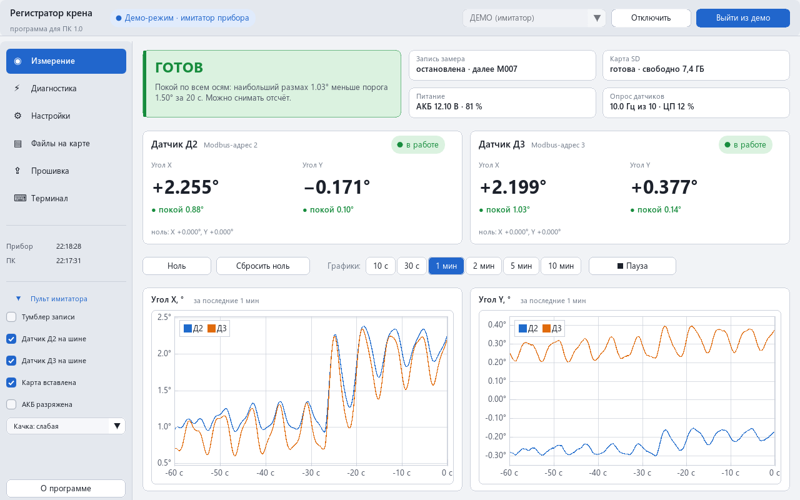
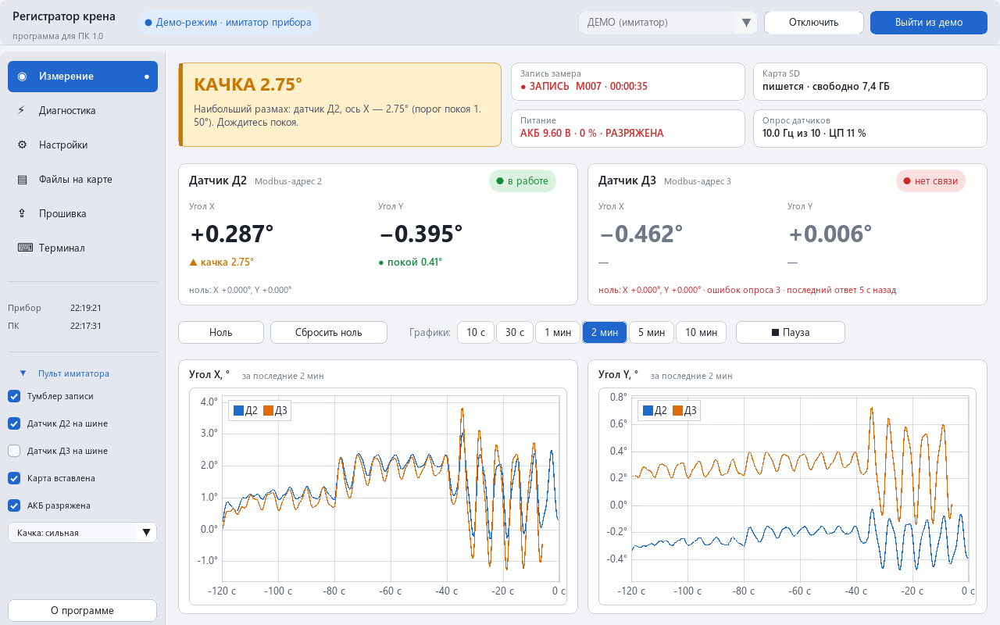
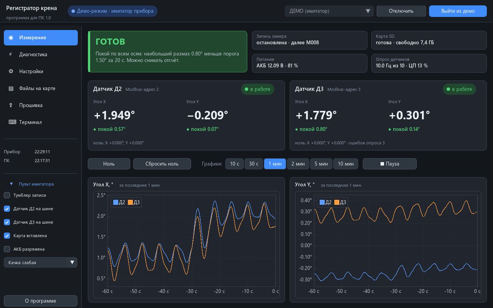
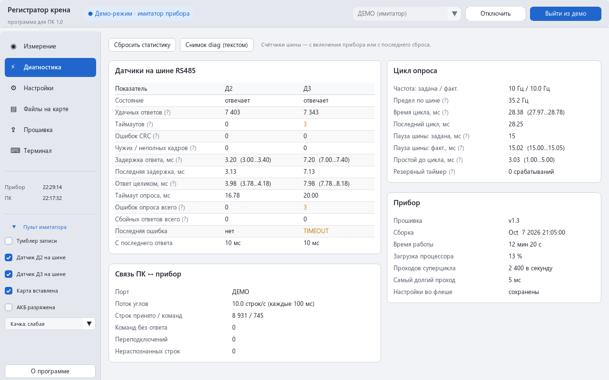
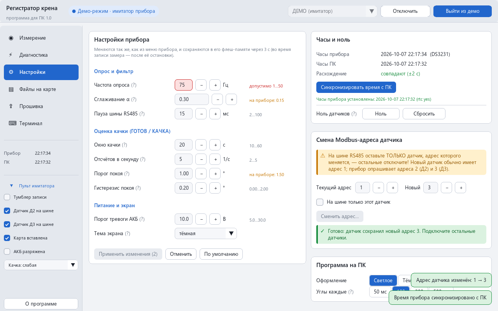
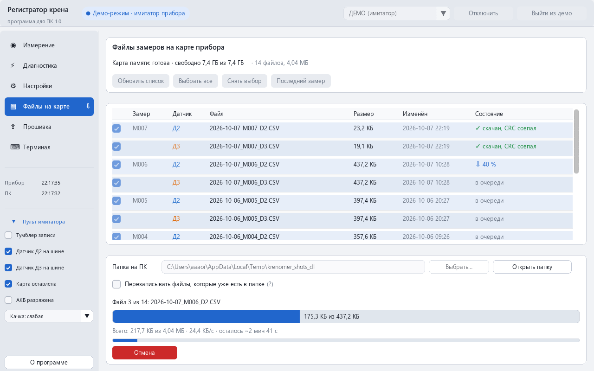
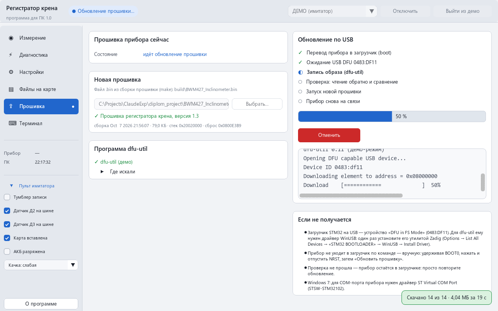
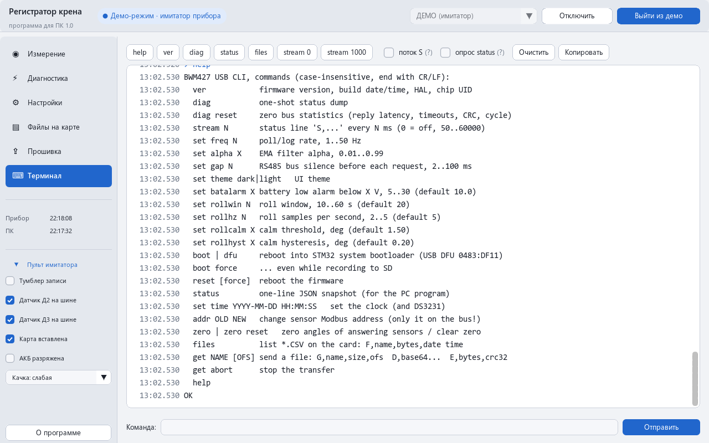
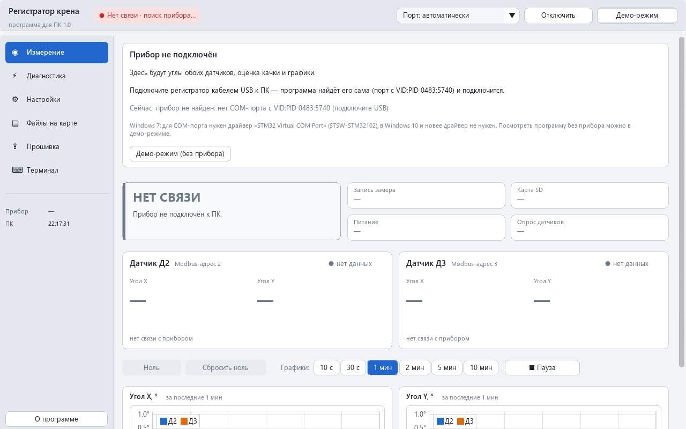

# Регистратор крена — программа для ПК (`krenomer.exe`)

Программа для Windows к [регистратору крена](../README.md) (STM32F411 + два
инклинометра BWM427): показывает углы и качку обоих датчиков с графиками,
диагностику шины RS485, меняет настройки прибора, скачивает файлы замеров с карты
памяти и обновляет прошивку — всё кнопками, без запоминания команд. Работает с
прибором по USB (виртуальный COM-порт), находит его сама и сама переподключается.

Один файл `krenomer.exe`, без установки и без DLL; **Windows 7 SP1 и новее**
(64-битная сборка и 32-битная — для 32-битной Windows 7).

<p align="center">
  
</p>
<p align="center">
  
  
</p>
<p align="center">
  
  
</p>
<p align="center">
  
  
</p>
<p align="center">
  
  
</p>
<p align="center"><sub>Снимки — стенд <code>tests/ui_shots.cpp</code> (демо-режим, имитатор прибора, без окна и видеокарты).</sub></p>

## Содержание

- [Возможности](#возможности)
- [Что нужно на ПК](#что-нужно-на-пк)
- [Как пользоваться](#как-пользоваться)
- [Сборка](#сборка)
- [Устройство программы](#устройство-программы)
- [Протокол с прибором](#протокол-с-прибором)
- [Тесты и снимки экрана](#тесты-и-снимки-экрана)
- [Ограничения и что дальше](#ограничения-и-что-дальше)
- [Лицензии](#лицензии)

## Возможности

| Страница | Что на ней |
|---|---|
| **Измерение** | Сводка крупно: «ГОТОВ» (покой по всем осям), «КАЧКА 2.10°» (худшая ось и её датчик), «СБОР ДАННЫХ 12 из 20 с» (окно качки ещё не заполнено), «НЕТ ДАТЧИКОВ». Плитки: запись (идёт ли, номер замера, время), карта (готова / нет / ошибка, свободное место), питание (напряжение и заряд АКБ, тревога, питание от USB), опрос (фактическая и заданная частота, загрузка процессора). Карточки датчиков Д2 и Д3: углы X и Y крупно, состояние («в работе» / «нет связи» / «не подключён»), качка по каждой оси («покой · размах 0.12°», «качка 1.23°», «сбор 12 из 20 с»), ноль, ошибки опроса. Кнопки «Ноль» / «Сбросить ноль» (с подтверждением). Графики углов X и Y обоих датчиков за 10 с, 30 с, 1, 2, 5 или 10 мин, пауза |
| **Диагностика** | По каждому датчику: удачные ответы, таймауты, ошибки CRC, чужие и неполные кадры, задержка ответа (средняя, мин.…макс., последняя), время ответа целиком, таймаут опроса, ошибки и сбойные ответы с включения, последняя ошибка, давность ответа. Цикл опроса: заданная и фактическая частота, предел по шине, время цикла, пауза шины (заданная и измеренная), простой перед циклом, резервный таймер. Прибор: прошивка, время работы, загрузка, суперцикл. Связь ПК ↔ прибор. «Сбросить статистику» (`diag reset`) и «Снимок diag» — полный текст `diag` с копированием |
| **Настройки** | Частота опроса, сглаживание α, пауза шины, окно качки, отсчётов в секунду, порог покоя, гистерезис, порог тревоги АКБ, тема экрана прибора — с пределами из прошивки (`app.h`, `bwm427.h`): значение вне пределов подсвечивается, «Применить» отправляет только изменённое и показывает ответ прибора. Часы прибора и ПК, расхождение, «Синхронизировать время с ПК». Ноль. Смена Modbus-адреса датчика: предупреждение «на шине только этот датчик», подтверждение, ход и итог. Оформление программы и частота потока углов |
| **Файлы на карте** | Список `*.CSV` на карте (замер, датчик, размер, время), выбор (все / последний замер), папка на ПК, скачивание с прогрессом (файл, всего, скорость, сколько осталось), проверка CRC-32 каждого файла, отмена. Во время записи замера недоступно. Файлы, которые уже есть в папке, не скачиваются заново (если не отмечено «Перезаписывать») |
| **Прошивка** | Текущая версия прибора; выбор `.bin` и проверка образа (векторы, размер, строка версии в образе); поиск dfu-util; обновление по шагам: `boot` → USB DFU 0483:DF11 → запись → чтение обратно и побайтное сравнение → запуск → прибор снова на связи, версия. Журнал dfu-util. Если идёт запись — «Прервать запись и обновить» (`boot force`) |
| **Терминал** | Любая команда прибора вручную, история (↑/↓), быстрые кнопки (`help`, `ver`, `diag`, `status`, `files`, …), весь обмен с прибором, по флажкам — поток `S,…` и опрос `status` |

Ещё: **демо-режим** — встроенный имитатор прибора с тем же протоколом (поток,
`status`, файлы с содержимым, `get`, смена адреса, перезагрузка, «перепрошивка»
без dfu-util), с пультом слева: тумблер записи, датчики на шине, карта, АКБ, сила
качки. Светлая и тёмная темы. Окно — от 1000×620; на экранах до 1366×800
открывается развёрнутым. Масштаб под DPI монитора.

## Что нужно на ПК

- **Windows 7 SP1** и новее. `krenomer.exe` — 64-битный; для 32-битной Windows 7 —
  сборка `build-win7-x86.cmd`. Ничего не устанавливается (статическая сборка, без
  Visual C++ Redistributable). Видеокарта — OpenGL 3.0, на старых встроенных и в
  удалённом рабочем столе — OpenGL 2.1/1.1 (переключается сама).
- **Драйвер COM-порта прибора.** Windows 10/11 подключает стандартный `usbser.sys`
  сама. **Windows 7** — нужен драйвер ST «STM32 Virtual COM Port» (STSW-STM32102,
  с сайта st.com), один раз; после него прибор виден как «STMicroelectronics Virtual
  COM Port (COMx)».
- **Для обновления прошивки:** `dfu-util.exe` (0.9 или новее, сборка для Windows) —
  рядом с `krenomer.exe` или в папке `dfu-util` рядом с ним; программа найдёт и
  копию из Arduino IDE (`%LOCALAPPDATA%\Arduino15\…\dfu-util`), `PATH` и переменную
  `DFU_UTIL`. Загрузчику STM32 (USB DFU 0483:DF11, «STM32 BOOTLOADER») нужен
  драйвер **WinUSB** — один раз утилитой [Zadig](https://zadig.akeo.ie/) (работает
  и в Windows 7): Options → List All Devices → STM32 BOOTLOADER → WinUSB → Install.
- Настройки программы (папка для файлов, окно графиков, тема, …) —
  `%APPDATA%\Krenomer\krenomer.ini`. Запускается одна копия программы (COM-порт
  может открыть только одна).

## Как пользоваться

1. Подключите прибор кабелем USB и запустите `krenomer.exe` — в шапке появится
   «На связи · COMx · прошивка v1.3». Если не появилось — подсказка на странице и
   во всплывающей подсказке над плашкой связи (нет порта, порт занят, драйвер).
2. **Измерение** — для опыта кренования: после переноса груза дождитесь «ГОТОВ»
   (качка по всем осям меньше порога за окно), затем снимайте отсчёт. Запись
   замера включается тумблером на приборе.
3. **Файлы на карте** — после замера (тумблер в STOP): «Последний замер» →
   «Скачать выбранные»; файлы ложатся в «Документы\Регистратор крена» (или
   выбранную папку), каждый проверен CRC.
4. **Настройки** — поменять значения и «Применить»; прибор сохранит их во флеш
   через 3 с (во время записи — после её остановки).
5. **Прошивка** — выбрать `BWM427_Inclinometer.bin` (из `make`), «Обновить
   прошивку…».

Без прибора: кнопка «Демо-режим» (или `krenomer.exe --demo`) — все страницы
работают с имитатором.

## Сборка

Тот же набор, что у ShagomerPCModule: C++23, CMake ≥ 3.24 + Ninja, зависимости из
vcpkg (манифест `vcpkg.json`: Dear ImGui с FreeType и привязками GLFW/OpenGL 2/3,
ImPlot, GLFW, CSerialPort, FreeType), статический CRT, тулсет **MSVC v143
14.44** (статическая STL тулсета v145 тянет функции Windows 8+, и `.exe` не
запускается на Windows 7).

Нужны Visual Studio 2022/2026 с компонентом «MSVC v143 - VS 2022 C++ x64/x86 build
tools (14.44)», vcpkg (`VCPKG_ROOT`, по умолчанию `C:\vcpkg`):

```bat
pc\build-win7.cmd                          rem build-win7\krenomer.exe (x64)
pc\build-win7-x86.cmd                      rem build-win7-x86\krenomer.exe (x86, 32 бита)
pc\build-win7.cmd -DKRENOMER_BUILD_TESTS=ON rem + тесты и стенд снимков
```

Скрипт вызывает `VsDevCmd.bat -vcvars_ver=14.44`, `cmake --preset default` (или
`win7-x86`) и сборку. После сборки `cmake/CheckWin7Imports.cmake` (из
ShagomerPCModule) проверяет таблицу импорта: функция Windows 8+ или DLL вида
`api-ms-win-*` — ошибка сборки, `.exe` удаляется. Пресет `win10` — без этой
проверки, любым тулсетом. Первая сборка ставит зависимости vcpkg (несколько
минут; со статическим триплетом `x64-windows-static-v143` из `triplets/`, как у
Шагомера, — значит, общий двоичный кэш vcpkg).

Результат (Release): `build-win7\krenomer.exe` — 4 564 480 байт (≈4,4 МБ; из них
запасные шрифты DejaVu ~1,8 МБ — ресурсами), 32-битный `build-win7-x86\krenomer.exe` —
4 244 480 байт.

Шрифт интерфейса — системный Segoe UI (обычный, Semibold, Bold) и Consolas в
терминале из `%WINDIR%\Fonts` (есть в Windows 7 и новее), растеризация FreeType с
лёгким хинтингом. Встроенные DejaVu — запасной вариант (если системного шрифта
нет или задана переменная окружения `KRENOMER_EMBEDDED_FONTS=1`) и источник
знаков, которых нет в Segoe UI. Чекбоксы и кнопки — свои (`ui::Checkbox`,
`ui::Button`, поле со шагом `ui::InputIntStep` / `InputDoubleStep` с кнопками
«−» / «+»). Импорт — только системные DLL Windows 7 (`OPENGL32`,
`SETUPAPI`, `ole32`, `SHELL32`, `COMDLG32`, `ADVAPI32`, `KERNEL32`, `USER32`,
`GDI32`, `IMM32`).

## Устройство программы

```
src/
  main.cpp                 один экземпляр, COM (окна выбора файла), RunUi()
  core/                    без интерфейса и Windows-окон
    Protocol.hpp           строки ответа (OK/ERR/DFU…), поток stream по именам колонок, status (JSON), ver, files,
                           пределы настроек
    Json.hpp, Codec.hpp    мини-разборщик JSON; base64, CRC-32
    Download.hpp           приём файла get (G/D/E) -> <папка>/<имя>.part -> проверка -> <имя>
    History.hpp            кольцо отсчётов для графиков (15 000: 10 мин при 25 Гц)
    PcSettings.hpp         krenomer.ini;  TextUtil.hpp — UTF-8/UTF-16, байты, длительности, углы
  comm/
    Connection.hpp         канал до прибора: SerialConnection (COM, CSerialPort), SimConnection (имитатор),
                           NullConnection (стенд снимков)
    SerialConnection.hpp   поиск портов 0483:5740 (SetupAPI через CSerialPort), hot-plug, переоткрытие
    SimDevice.hpp          прибор-имитатор: тот же протокол, что прошивка (usb_cli.c + usb_cli_ext.c)
    DeviceLink.hpp/.cpp    очередь команд, ответы, таймауты, проверка ver, поток, опрос status, история, журнал
  fw/
    Firmware.hpp           проверка образа, поиск dfu-util, USB DFU (SetupAPI), шаги обновления (Updater)
    Process.hpp            запуск dfu-util без окна, вывод по строкам
  ui/
    Renderer.cpp           GLFW + OpenGL 3 / 2, DPI, цикл кадров (как у Шагомера)
    App.hpp, App*.cpp      шапка, меню, страницы; Theme / Fonts / Widgets / Dialogs
```

**Потоки.** Интерфейс никогда не ждёт порт: `DeviceLink::Send()` только ставит
команду в очередь и возвращает `Request`, готовность (`done`) интерфейс проверяет в
следующих кадрах. Поток связи (`DeviceLink::Run`, шаг ~5 мс) открывает порт,
отправляет команды по одной, собирает строки ответа до `OK…`/`ERR…` (строки потока
`S,…` и шапка `# S,…` разбираются в любой момент, хоть посреди ответа), следит за
таймаутами, раз в секунду опрашивает `status`, перезапускает поток, если он
замолчал. Байты из порта принимает поток CSerialPort и режет на строки
(`LineSplitter`: куски USB по 64 байта, `\r\n`). Скачивание и перепрошивка —
автоматы, их двигает `App::Tick()` в каждом проходе цикла окна, и при свёрнутом
окне тоже; dfu-util работает отдельным процессом, его вывод читает свой поток.

**Подключение.** Порт с VID:PID 0483:5740 (или выбранный вручную) открывается с
DTR = 1; через 200 мс — `ver` (до трёх попыток по 1 с). Ответ «BWM427…» — это
прибор: `stream 100` и `status`. Ответил что-то другое — чужое устройство ST с тем
же VID:PID: порт закрывается и больше не трогается до переподключения его к USB
(или до «Подключить»); промолчал — ещё одна попытка через 30 с. Три команды подряд
без ответа — порт переоткрывается; порт пропал (выдернули, `boot`, `reset`) — поиск
раз в секунду, прибор подхватывается сам.

## Протокол с прибором

Командная строка прибора описана в [README прошивки](../README.md#командная-строка-по-usb);
программа использует:

| Команда | Зачем |
|---|---|
| `ver` | проверка, что на порту регистратор, версия и сборка прошивки |
| `stream N` | углы для карточек и графиков (по умолчанию каждые 100 мс; на время скачивания — 500 мс); колонки — по именам из шапки `# S,…`, новые колонки в конце не мешают, без шапки — шапка прошивки 1.3 |
| `status` | раз в секунду: всё остальное (одна строка JSON, поля — [README прошивки](../README.md#командная-строка-по-usb)); на время смены адреса — каждые 300 мс |
| `set freq/alpha/gap/rollwin/rollhz/rollcalm/rollhyst/batalarm/theme` | «Настройки» |
| `set time ГГГГ-ММ-ДД ЧЧ:ММ:СС` | «Синхронизировать время с ПК» (местное время ПК) |
| `addr OLD NEW` | смена адреса; итог — `svc` в `status` |
| `zero`, `zero reset` | ноль |
| `diag`, `diag reset` | «Диагностика» |
| `files`, `get <имя>`, `get abort` | «Файлы на карте» |
| `boot` / `boot force` | «Прошивка» (переход в загрузчик) |

Пределы настроек — как в прошивке: частота 1…50 Гц, α 0,01…0,99, пауза шины
2…100 мс, окно качки 10…60 с, отсчётов 2…5 в секунду, порог покоя 0,10…10,0°,
гистерезис 0…2,0°, порог АКБ 5…30 В (`src/core/Protocol.hpp`, `proto::limits`).
Значение вне пределов программа не отправляет (прибор и сам ограничивает).

**Скачивание файла.** На время скачивания опрос `status` останавливается, а поток
углов замедляется до 500 мс (строки `D` идут быстрее, графики живут). `get <имя>`
→ `G,<имя>,<размер>,0`, строки `D,<base64>` пишутся в `<имя>.part`, по `E,<байт>,<crc32>`
сверяются число байт и CRC-32 всего файла; совпало — `.part` переименовывается в
`<имя>`, нет — удаляется, и файл скачивается заново целиком (до двух повторов при
потере связи или несовпадении). Таймаут — 6 с без новых строк. Отмена — `get abort`
вне очереди.

**Перепрошивка** — как `tools/flash/dfu_flash.cmd`:
```
dfu-util -d 0483:df11 -a 0 -s 0x08000000 -D image.bin                 запись
dfu-util -d 0483:df11 -a 0 -s 0x08000000:<размер> -U readback.bin     чтение обратно + сравнение
dfu-util -d 0483:df11 -a 0 -s 0x08000000:4:leave -U leave.bin         запуск прошивки
```
Образ копируется во временную папку (короткий путь — dfu-util не понимает
кириллицу вне кодовой страницы). Сектор 7 (настройки прибора) не стирается.

## Тесты и снимки экрана

```bat
pc\build-win7.cmd -DKRENOMER_BUILD_TESTS=ON
ctest --test-dir pc\build-win7 --output-on-failure
pc\build-win7\ui_shots.exe --out shots
```

| Тест | Что проверяет |
|---|---|
| `protocol_test` (211 проверок) | строки ответа и `LineSplitter` (куски по 7 байт); поток: шапка, колонки по именам, новые колонки в конце, старая прошивка без колонок шины, без шапки; разборщик JSON; `status` — образец из host-теста прошивки (`tests/data/status_fw.json` = `build_host/status_sample.json`), новые поля, не-JSON; `ver` (с номером версии и без); `files` (запятые в имени, старые имена `M_NNN_k`); base64 и CRC-32; приём файла: успех, порченый байт, нет `E`, `ERR` посреди, мусор, кириллица в пути; тексты |
| `link_test` (96) | `DeviceLink` с имитатором в модельном времени и в реальном (поток связи, 20 команд из «интерфейса»): подключение, частота потока, история, опрос; `set`, `set time`, `zero`, `diag`; `files` и скачивание двух файлов (сравнение с содержимым имитатора), поток при скачивании, отмена посреди передачи, нет файла; запись (отказы `files`/`boot`/`addr`, прерванная передача); `reset` и `boot` → DFU → снова на связи (новая версия); смена адреса и `svc`; чужой порт (ответил не BWM427 / молчит), зависший прибор → переоткрытие; подключение, пока прибор досылает чужую передачу (хвост D/E и лишний OK до ответа на ver, затем `get abort`); строки потока посреди ответа |
| `firmware_test` (35) | проверка образа (синтетические и настоящий `.bin` из сборки прошивки — версия 1.3); прогресс dfu-util; обновление с имитатором целиком; отказ при записи и `boot force`; плохой образ; запуск процесса (вывод, код выхода), поиск dfu-util |
| `ui_shots` (62) | весь интерфейс без окна и видеокарты: 20 снимков (растеризация ImDrawData в PNG — из стенда `ui_smoke` Шагомера) на 1280×800 и 1024×700 и проверки: нигде нет горизонтальной прокрутки, основные страницы помещаются без вертикальной, индексы отрисовки в пределах, кадр не пустой, файлы реально скачались |

Снимки (в `--out`): `00_not_connected`, `01_measure`, `02_measure_calm`,
`03_measure_recording`, `04_measure_10min`, `05_measure_dark`,
`06_measure_1024x700`, `06_settings_1024x700`, `06_files_1024x700`, `07_diag`,
`07_diag_text`, `08_settings_addr_progress`, `09_settings`, `10_files_download`,
`11_files_done`, `12_firmware_progress`, `13_firmware_done`, `14_terminal`,
`15_about`. Выборка — в `docs/img/`.

## Ограничения и что дальше

- **С настоящим прибором программа ещё не запускалась** (ноутбук прибора без
  сети): протокол проверен host-тестами прошивки (`tests/host`, в том числе
  образец JSON прошивки — в тестах программы), имитатором и юнит-тестами. При
  первом подключении проверить: находится ли порт, частота потока, скачивание
  большого файла (скорость), перепрошивку с WinUSB на Windows 7.
- VID:PID 0483:5740 общий для устройств ST: на чужой такой порт программа
  отправит `ver` (один раз; промолчавшему — ещё раз через 30 с) и оставит его в
  покое.
- Скачивание после обрыва начинается заново (прошивка умеет `get <имя> <смещение>`,
  программа его пока не использует — так каждый файл целиком проверен одной CRC).
- Нет просмотра скачанных CSV и отчёта по замеру (графики — только «живые»);
  нет экспорта живых данных — кандидаты на следующую версию.
- Масштаб под DPI берётся при запуске (перетаскивание окна на монитор с другим DPI
  не перестраивает шрифты).
- `set time` ставит местное время ПК с точностью до секунды.

## Лицензии

Свой код — как у всего репозитория. Сторонние компоненты (в `.exe` статически):
Dear ImGui и ImPlot — MIT; GLFW — zlib/libpng; FreeType — FreeType License;
CSerialPort 4.3 — LGPL-3.0 с исключением для статической линковки; запасные шрифты
DejaVu Sans / Sans Bold / Sans Mono 2.35 — лицензия Bitstream Vera / DejaVu
(`assets/fonts/LICENSE_DEJAVU.txt`); системные шрифты Windows (Segoe UI, Consolas)
в программу не входят — читаются из системы. dfu-util (GPL-2.0) — отдельная программа, в
`krenomer.exe` не входит. Сборочные скрипты, проверка импортов Windows 7, растеризатор
снимков и `TestUtil.hpp` — из ShagomerPCModule (тот же автор).
